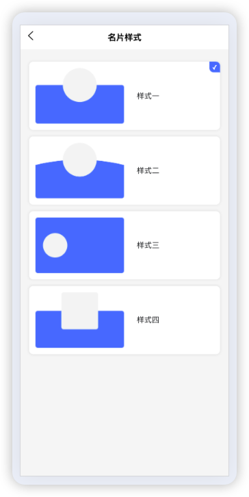
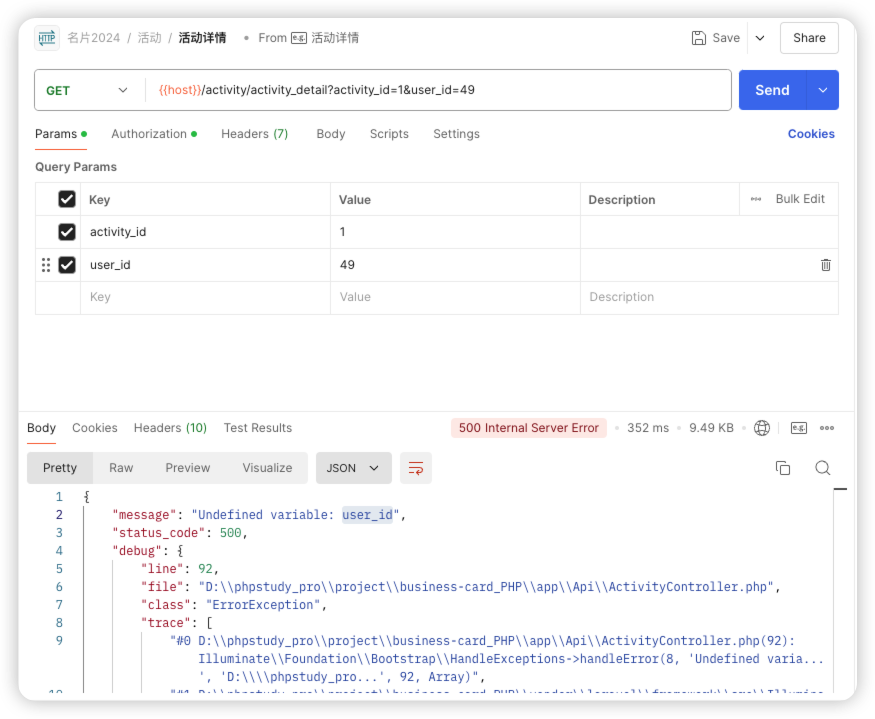
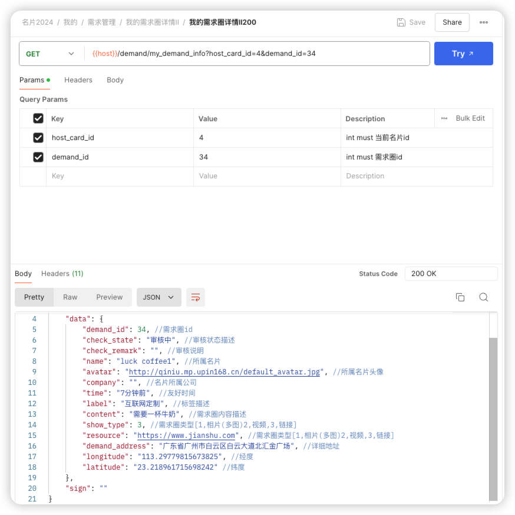

# 微米名片

## 核销码

## 名片夹

-   最近浏览

缺少`职位` `卡片类型` `公司名称` <http://127.0.0.1:8080/api/radar/me_see_who?page=1&pageSize=10&type=3&host_card_id=29>

|  |  |
| ------------------------- | ------------------------- |

## 缺少切换名片样式接口

## 登录时 返回默认名片信息

-   <https://api.aicard.xuancollege.com/auth/miniwx_login> 微信登录
-   {{host}}/auth/pwd_login h5 登录

## 缺少添加名片标签

## 编辑名片缺少名片样式 style_id

<http://127.0.0.1:8080/api/card/card_detail?host_card_id=48>

## 名片

-   访问他人名片

    1. 缺少`录音链接` `视频链接` `图集` <http://127.0.0.1:8080/api/card/visit_card?host_card_id=29&card_id=1>

## 活动

-   活动详情 <http://127.0.0.1:8080/api/activity/activity_detail?activity_id=8>
    

## 发现

-   需求详情

    1. 缺少 `video` `images` 字段 <http://127.0.0.1:8080/api/demand/demand_info?host_card_id=29&demand_id=49>
       

## 我的

-   消息通知 清除

    1. 缺少 清空评论的接口
       
